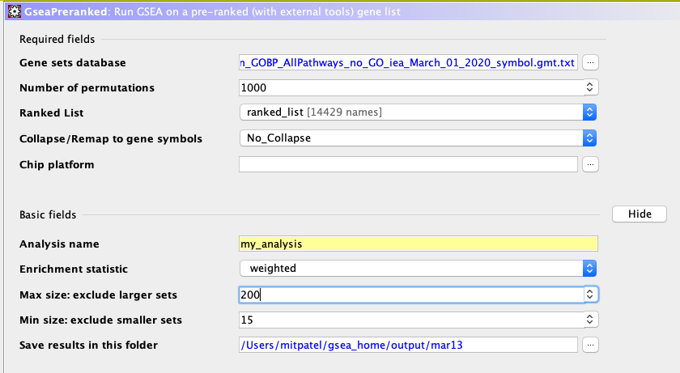
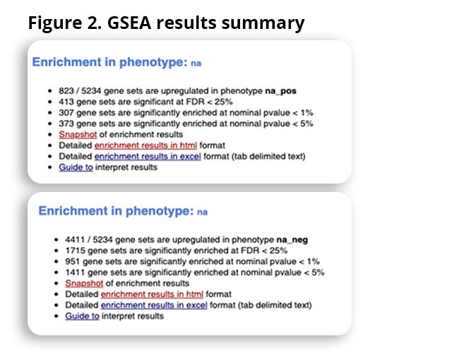
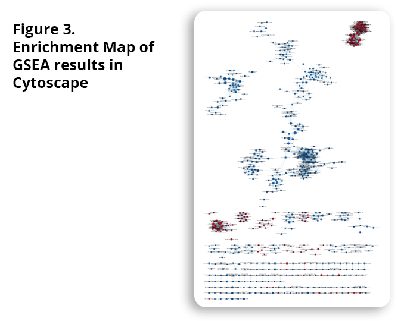
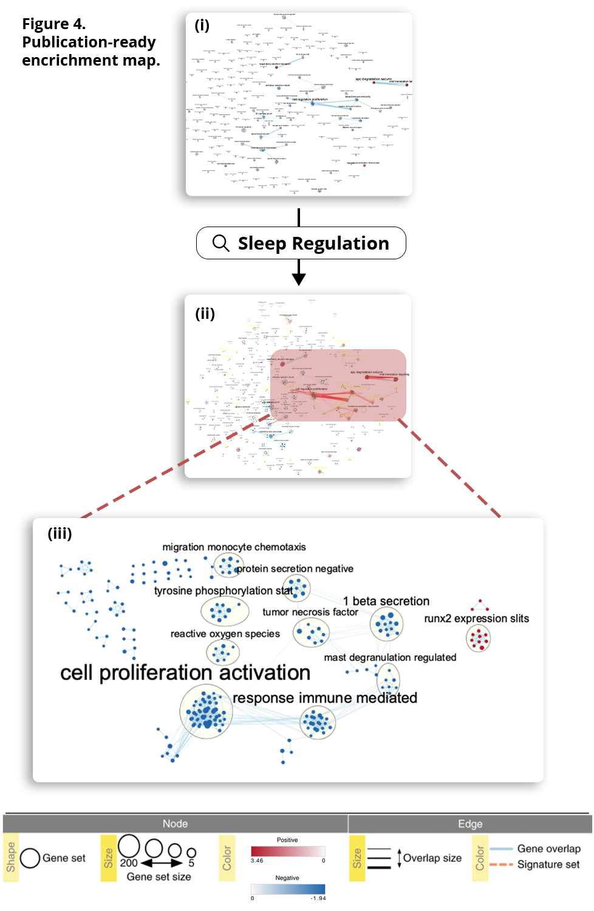
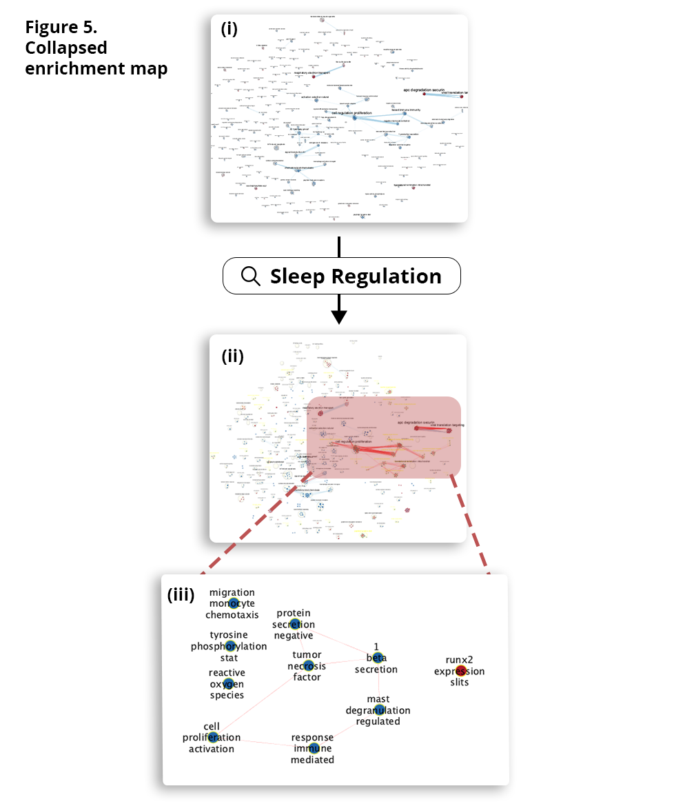

## Dataset Information 
**Publication Title:** Transcriptomic analyses reveal rhythmic and CLOCK-driven pathways in human skeletal muscle\
**Publication Date:** 2018-04-16\
**Publication Journal:** eLife\
**GEO ID:** GSE108539

We will first nest our A1 and A2 document in this notebook to continue our analysis.  
```{r nest a1 and 2, message=FALSE, warning=FALSE, child='A2_Mit_notext.Rmd', include=FALSE, eval=TRUE}
```

We will now setup and install the required libraries for this analysis. 
```{r, message=FALSE, results='hide'}
if (!requireNamespace("GSA", quietly = TRUE)) {
   install.packages(pkgs = c("GSA"),
           repos = "http://cran.rstudio.org",
           dependencies = TRUE,
           quiet = TRUE) 
}

if (!requireNamespace("VennDiagram", quietly = TRUE)) {
   install.packages(pkgs = c("VennDiagram"),
           repos = "http://cran.rstudio.org",
           dependencies = TRUE,
           quiet = TRUE) 
}
library(GSA)
library(VennDiagram)
```

## Information about Platform
**Platform Title:** `r current_gpl_info$title`\
**Original submission date:** `r current_gpl_info$submission_date`\
**Last update date:** `r current_gpl_info$last_update_date`\
**Organism:** `r current_gpl_info$organism`\
**No. of GEO datasets that use this technology:** `r length(current_gpl_info$series_id)`\
**No. of GEO samples that use this technology:** `r length(current_gpl_info$sample_id)`

## Previous Analyses: 
We first selected a dataset of interest, cleaned and normalized the gene counts and mapped the gene names to HUGO symbols. 

We then performed differential gene expression analysis. For this, we designed a model to test one timepoint (20:00) against all other timepoints to calculate differential expression. The participants were awake at the 20:00 timepoint, and so we compared this against the samples where they were asleep. 

We previously left off with completing a thresholded over-represntation analyaysis (ORA), where g:Profiler was used to map genes to known functional information from various datasources such as GO: Biological Proccesses.  

## A3 Analysis Objectives: 
1. Perform non-thresholded gene enrichment analysis using GSEA [2], [4]. 
2. Visualize and analyze the non-thresholded gene enrichment analysis in Cytoscape [Ref].
3. Peform analysis on "dark matter" (the genes )

## A3 Analysis
First, we will generate our ranked list (from A2), omitting unneeded columns. We will also export this list of ranked genes for further analysis using in the GSEA software [2], [4]. 
```{r}
ranked_list <- qlf_output_hits_withgn[, c("hgnc_symbol", "rank")]
ranked_list[1:10, ]
ranked_list <- ranked_list[ranked_list$hgnc_symbol != "", ] # removing rows with no gene name. 
write.table(ranked_list[2:nrow(ranked_list), ], file="data/ranked_list_twopoints.rnk", row.names = FALSE, sep="\t", quote=FALSE)
```
We used the ranked list generated in the previous block and downloaded the GO (Biological Processes without GO annotations with evidence codes (IEA, ND, and RCA))[http://download.baderlab.org/EM_Genesets/March_01_2020/Human/symbol/Human_GOBP_AllPathways_no_GO_iea_March_01_2020_symbol.gmt] from the Bader Lab downloads directory. 
The following settings were used for the GSEA Preranked analysis: 

This results in the following summary: 

Here, na_pos are the upregulated genes and na_neg are down regulated genes. Immediately, we will notice that there are far more down regulated genesets in comparison to upregulated. 

### Visualizing GSEA in in Cytoscape
Next, we take the GSEA analysis and load it into Cytoscape for visualization and further analysis. 

The EnrichmentMap [1] app for Cytoscape was used to visaulize the GSEA results. The files from the GSEA results were inputted into EnrichmentMap. Parameters were adjusted such that the FDR Q value cutoff was set to 0.01. The EnrichmentMap build was then executed, resulting in the following map: 

The resulting Enrichment Map has 694 nodes and 4456 edges. 

### Creating a Publication Ready Figure
We performed a search query on the EnrichmentMap, selecting nodes and edges in the Sleep Regulation pathway. 
The selected nodes and edges were then annotated using AutoAnnoate. The parameters in AutoAnnotate were "Annotate Entire network", limited to the "Sleep Regulation" search query selected nodes and edges. The "layer network to prevent cluster overlap" selector was selected and the label column was set to GS_DESCR. The "Publication-Ready" selector was selected under the EnrichmentMap panel, removing labels on individual nodes. These settings result in the following publication ready image: 


### Collapsed Theme Network 
We then created a collapsed theme network through the AutoAnnotate tab in the control panel. 


### Dark Matter Analysis 
We will analyze the genes that have no information from our analyses. In particular, we will highlight and investigate that are significantly differentially expressed in our model but are not annotated to any pathways. 

First, we will load in our GSEA data and prepare our expression and ranked data. 
```{r}
gmt_file <- file.path(getwd(),"data",
                    "Human_GOBP_AllPathways_no_GO_iea_March_01_2020_symbol.gmt")
capture.output(genesets<- GSA.read.gmt(gmt_file),file="gsa_load.out")
names(genesets$genesets) <- genesets$geneset.names
expression <- normalized_count_data_exons
ranks <- ranked_list
```
Next, we will load in the data from our GSEA pre-ranked analysis. 
```{r}
#get all the GSEA directories
gsea_directories <- list.files(path = file.path(getwd(),"data"), 
                                 pattern = "\\.GseaPreranked")
if(length(gsea_directories) == 1){
  gsea_dir <- file.path(getwd(),"data",gsea_directories[1])
  #get the gsea result files
  gsea_results_files <- list.files(path = gsea_dir, 
                                 pattern = "gsea_report_*.*.xls")

    enr_file1 <- read.table(file.path(gsea_dir,gsea_results_files[1]), 
                        header = TRUE, sep = "\t", quote="\"",  
                        stringsAsFactors = FALSE,row.names=1)
  enr_file2 <- read.table(file.path(gsea_dir,gsea_results_files[1]), 
                        header = TRUE, sep = "\t", quote="\"",  
                        stringsAsFactors = FALSE,row.names=1)
}
```

```{r}
all_enr_genesets<- c(rownames(enr_file1), rownames(enr_file2))
genes_enr_gs <- c()
for(i in 1:length(all_enr_genesets)){
  current_geneset <- unlist(genesets$genesets[which(genesets$geneset.names %in% all_enr_genesets[i])]) 
  genes_enr_gs <- union(genes_enr_gs, current_geneset)
}
```

```{r}
FDR_threshold <- 0.001
#get the genes from the set of enriched pathwasy (no matter what threshold)
all_sig_enr_genesets<- c(rownames(enr_file1)[which(enr_file1[,"FDR.q.val"]<=FDR_threshold)], rownames(enr_file2)[which(enr_file2[,"FDR.q.val"]<=FDR_threshold)])
genes_sig_enr_gs <- c()
for(i in 1:length(all_sig_enr_genesets)){
  current_geneset <- unlist(genesets$genesets[which(genesets$geneset.names %in% all_sig_enr_genesets[i])]) 
  genes_sig_enr_gs <- union(genes_sig_enr_gs, current_geneset)
}
genes_all_gs <- unique(unlist(genesets$genesets))
```

```{r, message=FALSE}
A <- genes_all_gs
B <- genes_enr_gs
C <- expression[,2]
png(file.path(getwd(),"data","dark_matter_overlaps.png"))
draw.triple.venn( area1=length(A), area2=length(B), area3 = length(C),
                  n12 = length(intersect(A,B)), n13=length(intersect(A,C)),
                  n23 = length(intersect(B,C)), 
                  n123 = length(intersect(A,intersect(B,C))),
                  category = c("all genesets","all enrichment results","expression"),
                  fill = c("red","green","blue"),
                  cat.col = c("red","green","blue")
)
```

```{r}
genes_no_annotation <- setdiff(expression[,2], genes_all_gs)
ranked_gene_no_annotation <- ranks[which(ranks[,1] %in% genes_no_annotation),]
ranked_gene_no_annotation[1:10,]

```


### Questions - Non-thresholded Gene set Enrichment Analysis 
1. What method did you use? What genesets did you use? Make sure to specify versions and cite your methods.
    - GSEA was used for non-thresholded gene set analysis [2], [4]. 
    - The Bader Lab gene sets [1] were used as they are regularly updated with the latest annonations data. In particular, the March 2020, containing GO Human Biological process annotations and no IEA and pathways annotations was used [Gene set file link](http://download.baderlab.org/EM_Genesets/March_01_2020/Human/symbol/Human_GOBP_AllPathways_no_GO_iea_March_01_2020_symbol.gmt).
2. Summarize your enrichment results.
    - Overall, there are 5234 gene sets identified when datasets are restrictings between 15-200 genes. 
    - Within the 5234 genests, there are 823 genesets that are enriched with upregulated genes and 4411 genes that are enriched downregulated genes (heavilty in favour of gene sets enriched with down regulated genes)
    - The top gene in the upregulated gene sets is Electron Transport Chain (GOBP) with a size of 79, ES value of 0.83, NES value of 3.46 and p-value of 0. 
    - The top gene in the downregulated gene sets is Hallmark TNFA Signaling via NFKB with a size of 170, ES value of -0.87, NES value of -1.94 and p-value of 0.
3. How do these results compare to the results from the thresholded analysis in Assignment #2. Compare qualitatively. Is this a straight forward comparison? Why or why not?
    - Right off the bat, we a large discrepancy. We have a total of 5234 gene sets from the non-thresholded analysis, while we had 36689 gene sets from just GO: Biological processes (which is one of the annotation sources also used in the Bader Lab genesets. 
    - There is a similar pattern in terms of ratio of upregulated vs downregulated gene set numbers. There were significantly more gene sets for the downregulated in the thresholded analysis. 
    - Some other similarities can be identified. For example, the top gene in the upregulated set using GSEA is Electron Transport Chain and this gene is also in the top 15 in the gprofiler analysis (under GOBP).
    - Just based on the number of genesets, show the results vary signficiantly between methods, making it difficult to compare the two analyses.git 
    - How data is organized also makes the comparing the methods difficult. Using gprofiler, the genes are seperated by annotation source while GSEA combines all annotations sources. 

## References
[1]D. Merico, R. Isserlin, O. Stueker, A. Emili, and G. D. Bader, “Enrichment Map: A Network-Based Method for Gene-Set Enrichment Visualization and Interpretation,” PLoS ONE, vol. 5, no. 11, p. e13984, Nov. 2010, doi: 10.1371/journal.pone.0013984.

[2]A. Subramanian et al., “Gene set enrichment analysis: A knowledge-based approach for interpreting genome-wide expression profiles,” Proceedings of the National Academy of Sciences, vol. 102, no. 43, pp. 15545–15550, Oct. 2005, doi: 10.1073/pnas.0506580102.

[3]J. Reimand et al., “Pathway enrichment analysis and visualization of omics data using g:Profiler, GSEA, Cytoscape and EnrichmentMap,” Nat Protoc, vol. 14, no. 2, pp. 482–517, Feb. 2019, doi: 10.1038/s41596-018-0103-9.

[4]V. K. Mootha et al., “PGC-1α-responsive genes involved in oxidative phosphorylation are coordinately downregulated in human diabetes,” Nat Genet, vol. 34, no. 3, pp. 267–273, Jul. 2003, doi: 10.1038/ng1180.

[5]L. Perrin et al., “Transcriptomic analyses reveal rhythmic and CLOCK-driven pathways in human skeletal muscle,” eLife, vol. 7, p. e34114, Apr. 2018, doi: 10.7554/eLife.34114.


