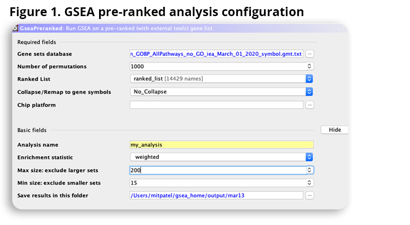

### Dataset Information 
**Publication Title:** Transcriptomic analyses reveal rhythmic and CLOCK-driven pathways in human skeletal muscle

**Publication Date:** 2018-04-16

**Publication Journal:** eLife

**GEO ID:** GSE108539

We will first nest our A1 and A2 document in this notebook to continue our analysis.  
```{r nest a1, message=FALSE, warning=FALSE, child='A2_Mit_notext.Rmd', include=FALSE, eval=TRUE}
```

## Information about Platform
**Platform Title:** `r current_gpl_info$title`\
**Original submission date:** `r current_gpl_info$submission_date`\
**Last update date:** `r current_gpl_info$last_update_date`\
**Organism:** `r current_gpl_info$organism`\
**No. of GEO datasets that use this technology:** `r length(current_gpl_info$series_id)`\
**No. of GEO samples that use this technology:** `r length(current_gpl_info$sample_id)`

## Previous Analyses: 

## A3 Analysis Objectives: 
1. 


First, we will generate our ranked list (from A2), omitting unneeded columns. We will also export this list of ranked genes for further analysis using in the GSEA software [2], [4]. 
```{r}
ranked_list <- qlf_output_hits_withgn[, c("hgnc_symbol", "rank")]
ranked_list[1:10, ]
ranked_list <- ranked_list[ranked_list$hgnc_symbol != "", ] # removing rows with no gene name. 
write.table(ranked_list[2:nrow(ranked_list), ], file="data/ranked_list.rnk", row.names = FALSE, sep="\t", quote=FALSE)
```
We used the ranked list generated in the previous block and downloaded the GO (Biological Processes without GO annotations with evidence codes (IEA, ND, and RCA))[http://download.baderlab.org/EM_Genesets/March_01_2020/Human/symbol/Human_GOBP_AllPathways_no_GO_iea_March_01_2020_symbol.gmt] from the Bader Lab downloads directory. 
The following settings were used for the GSEA Preranked analysis: 

This results in the following summary: 

Here, na_pos are the upregulated genes and na_neg are down regulated genes. Immediately, we will notice that there are far more down regulated genesets in comparison to upregulated. 

## Questions - Non-thresholded Gene set Enrichment Analysis 
1. What method did you use? What genesets did you use? Make sure to specify versions and cite your methods.
    - GSEA was used for non-thresholded gene set analysis [2], [4]. 
    - The Bader Lab gene sets [1] were used as they are regularly updated with the latest annonations data. In particular, the March 2020, containing GO Human Biological process annotations and no IEA and pathways annotations was used [Gene set file link](http://download.baderlab.org/EM_Genesets/March_01_2020/Human/symbol/Human_GOBP_AllPathways_no_GO_iea_March_01_2020_symbol.gmt).
2. Summarize your enrichment results.
    - Overall, there are 5234 gene sets identified when datasets are restrictings between 15-200 genes. 
    - Within the 5234 genests, there are 823 genesets that are enriched with upregulated genes and 4411 genes that are enriched downregulated genes (heavilty in favour of gene sets enriched with down regulated genes)
    - The top gene in the upregulated gene sets is Electron Transport Chain (GOBP) with a size of 79, ES value of 0.83, NES value of 3.46 and p-value of 0. 
    - The top gene in the downregulated gene sets is Hallmark TNFA Signaling via NFKB with a size of 170, ES value of -0.87, NES value of -1.94 and p-value of 0.
    - Right off the bat, we a large discripenacy.     
3. How do these results compare to the results from the thresholded analysis in Assignment #2. Compare qualitatively. Is this a straight forward comparison? Why or why not?
    - Right off the bat, we a large discrepancy. We have a total of 5234 gene sets from the non-thresholded analysis, while we had 36689 gene sets from just GO: Biological processes (which is one of the annotation sources also used in the Bader Lab genesets. 
    - There is a similar pattern in terms of ratio of upregulated vs downregulated gene set numbers. There were significantly more gene sets for the downregulated in the thresholded analysis. 
    - Some other similarities can be identified. For example, the top gene in the upregulated set using GSEA is Electron Transport Chain and this gene is also in the top 15 in the gprofiler analysis (under GOBP).
    - Just based on the number of genesets, show the results vary signficiantly between methods, making it difficult to compare the two analyses.git 
    - How data is organized also makes the comparing the methods difficult. Using gprofiler, the genes are seperated by annotation source while GSEA combines all annotations sources. 

## References
[1]D. Merico, R. Isserlin, O. Stueker, A. Emili, and G. D. Bader, “Enrichment Map: A Network-Based Method for Gene-Set Enrichment Visualization and Interpretation,” PLoS ONE, vol. 5, no. 11, p. e13984, Nov. 2010, doi: 10.1371/journal.pone.0013984.

[2]A. Subramanian et al., “Gene set enrichment analysis: A knowledge-based approach for interpreting genome-wide expression profiles,” Proceedings of the National Academy of Sciences, vol. 102, no. 43, pp. 15545–15550, Oct. 2005, doi: 10.1073/pnas.0506580102.

[3]J. Reimand et al., “Pathway enrichment analysis and visualization of omics data using g:Profiler, GSEA, Cytoscape and EnrichmentMap,” Nat Protoc, vol. 14, no. 2, pp. 482–517, Feb. 2019, doi: 10.1038/s41596-018-0103-9.

[4]V. K. Mootha et al., “PGC-1α-responsive genes involved in oxidative phosphorylation are coordinately downregulated in human diabetes,” Nat Genet, vol. 34, no. 3, pp. 267–273, Jul. 2003, doi: 10.1038/ng1180.

[5]L. Perrin et al., “Transcriptomic analyses reveal rhythmic and CLOCK-driven pathways in human skeletal muscle,” eLife, vol. 7, p. e34114, Apr. 2018, doi: 10.7554/eLife.34114.


